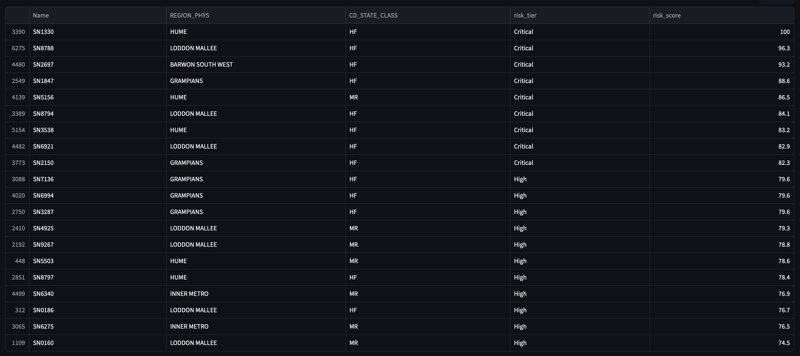
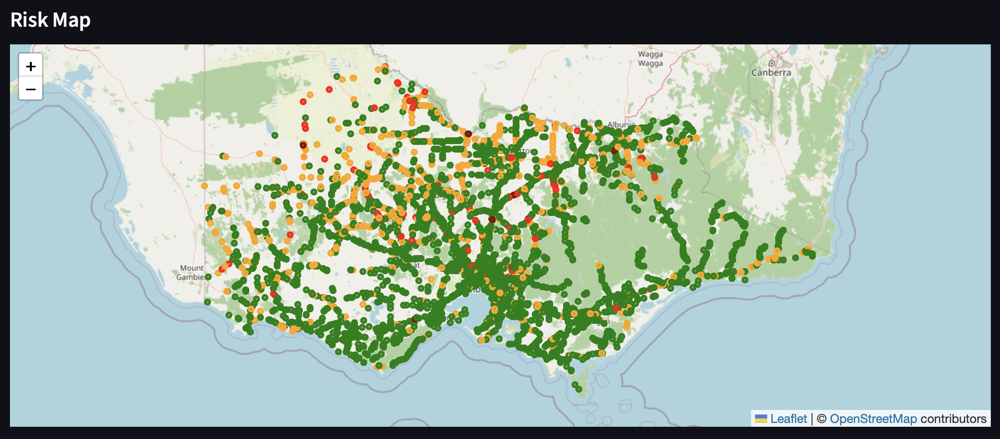

# InfraPulse

**Infrastructure Asset Risk and Investment Decision Support System**

A solo capstone project that scores and ranks 6,554 Victorian bridges by risk, to
support maintenance and investment prioritisation decisions. Built as a
deliberately minimal, local-first application: a batch pipeline writes flat CSV
outputs, consumed by a read-only Streamlit dashboard. No cloud dependency, no
authentication, no real-time components, by design.

## Screenshots

**KPI summary and top-20 ranked table**


**Risk map, colored by tier**


## Architecture

```
infrapulse/
├── data/processed/bridges_risk_scored.csv   # pipeline output, read-only for the app
├── pipeline/                                # batch scoring pipeline (separate from the app)
├── data_loader.py                           # shared CSV load + risk-tier logic
├── pages/
│   ├── home.py            # overview + headline stats
│   ├── dashboard.py       # filters, KPIs, map, ranked table
│   └── methodology.py     # data sources, scoring rationale, known limitations
├── streamlit_app.py        # entrypoint, defines navigation
└── .streamlit/config.toml  # theme
```

## Risk scoring, briefly

A transparent, rule-based multi-criteria score (0–100) — not a trained model:

- **Likelihood** = age (45%) + traffic (30%) + climate (25%), reweighted
  proportionally when a component is missing
- **Consequence multiplier** from road/state class (`CD_STATE_CLASS`): HF=1.5,
  MR=1.2, TR=1.1, RA/FR/unknown=1.0

Full rationale, data sources, and the reasons condition-rating data was dropped as
a model input are documented on the in-app **Methodology** page.

## Running locally

```bash
pip install streamlit pandas folium streamlit-folium
streamlit run streamlit_app.py
```

## Tech stack

Python, Pandas, Streamlit, Folium, Scikit-learn (pipeline), built with assistance
from Claude and Antigravity.
