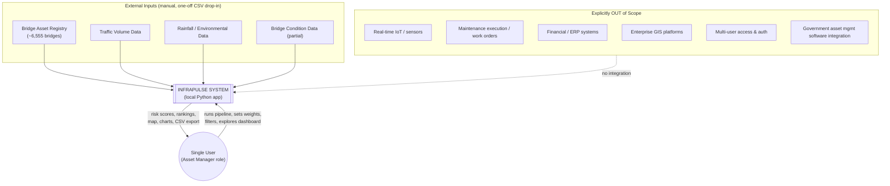
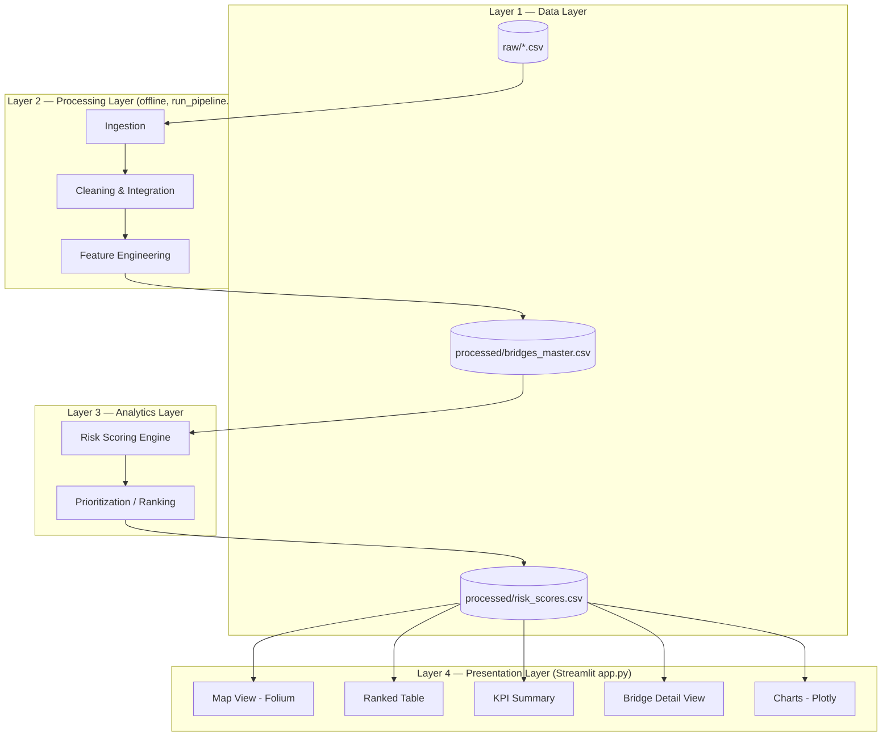
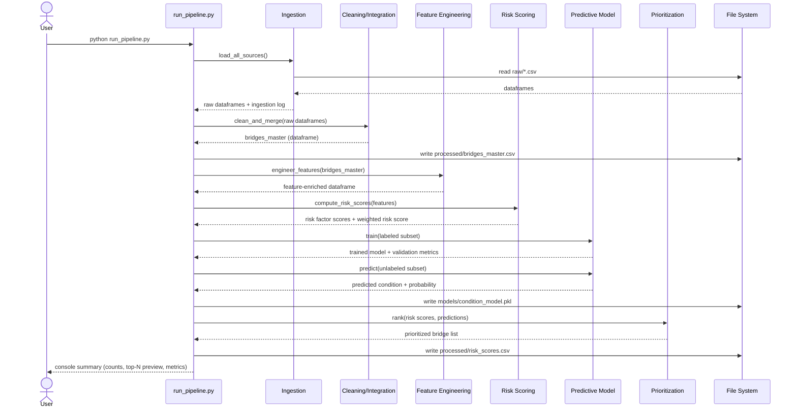
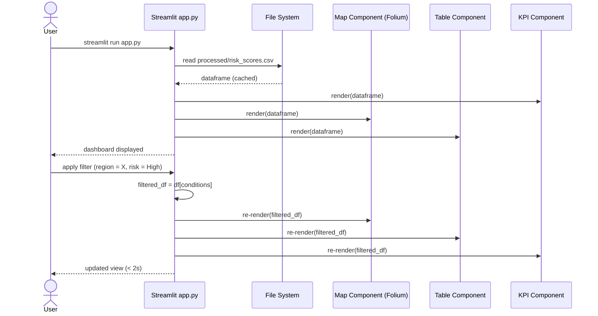
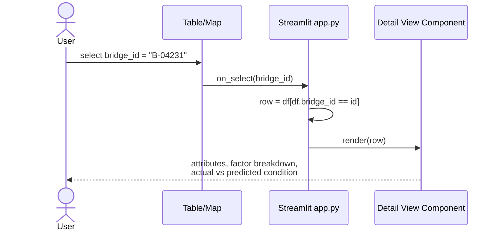
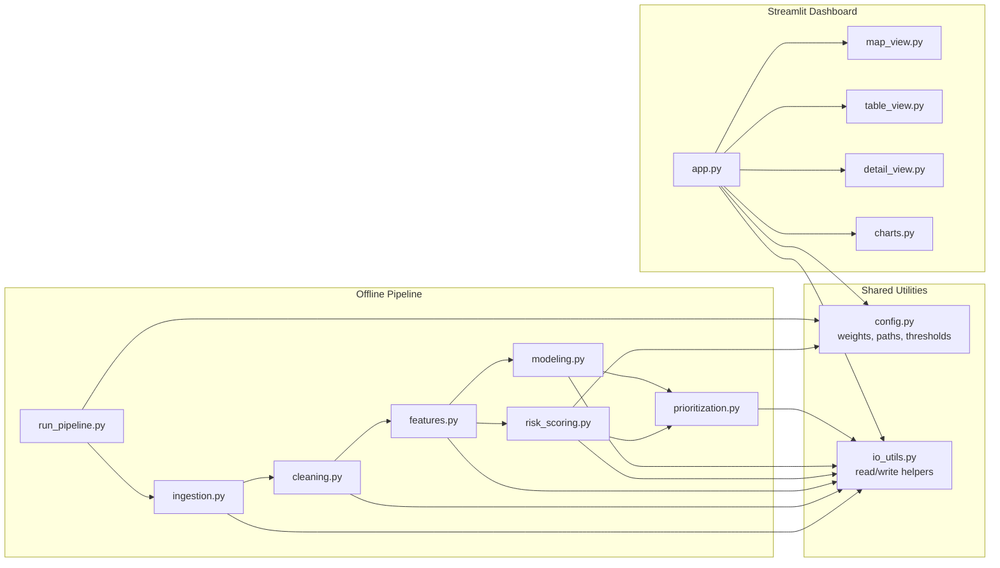
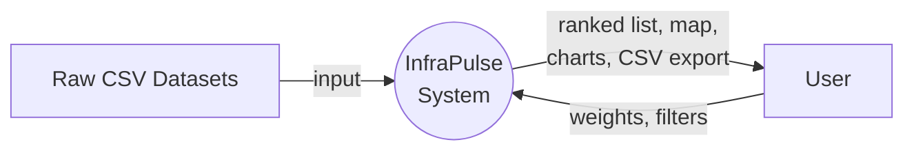
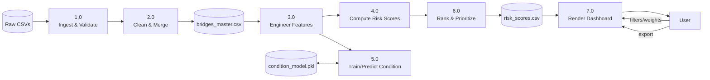
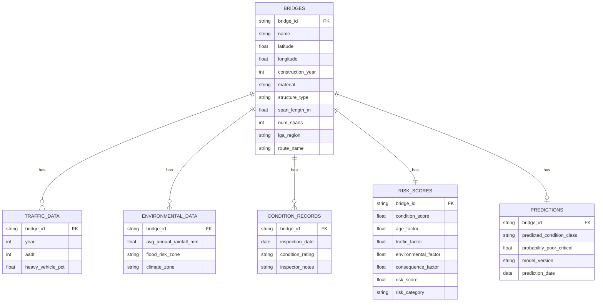

# InfraPulse
## Infrastructure Asset Risk and Investment Decision Support System
### Software Requirements Document (SRD)

**Author:** [Your Name] | **Role:** Solo Developer / Final-Year Engineering Student
**Duration:** 4 weeks | **Deadline:** End of month
**Stack:** Python, Pandas, Scikit-learn, Plotly, Streamlit, Folium
**Deployment:** Local, single-user, CSV-based, no cloud, no auth, no real-time feeds

---

## 0. Executive Summary — How the Whole System Works

Before the formal sections, here is the plain-English version, so you and Antigravity have the mental model before touching any of the detail below.

InfraPulse is **a batch data pipeline with a dashboard on top of it** — nothing more exotic than that. There is no server, no database engine, no API, no login. It runs in two modes:

1. **Offline pipeline (`run_pipeline.py`)** — you run this once (and re-run it whenever data or weights change). It reads the four raw CSVs (bridge registry, traffic, environment, condition), cleans and joins them on `bridge_id`, engineers features (age, traffic exposure, rainfall exposure, etc.), computes a **rule-based weighted risk score** for every bridge (Risk = Likelihood × Consequence) using age, traffic, and climate exposure, dynamically re-weighting components when data is missing, ranks every bridge by priority, and writes everything out to a handful of processed CSVs plus one saved model file.
2. **Dashboard (`streamlit run app.py`)** — a read-only viewer over those processed CSVs. It shows a map, a ranked table, filters, a bridge detail view, and (if time allows) a slider to re-weight the risk formula live. It does **not** re-run heavy data processing on every click — it re-runs the cheap weighted-sum math only, which is instant even for 6,555 rows.

That's the entire system. Everything in this document is that idea, expanded into requirements, diagrams, and a schedule.

---

## 1. Requirements Analysis Summary

| Aspect | Finding |
|---|---|
| **Problem** | Infrastructure owners (road authorities, councils) have thousands of bridges and limited maintenance budgets. They need an objective, repeatable way to say "fix this one before that one." |
| **Root cause it addresses** | Condition inspection data is incomplete (~6,555 bridges, not all recently inspected). Traffic and environmental exposure aren't currently combined with condition to form a single prioritized view. |
| **Core deliverable** | A ranked, explainable priority list of bridges, visualized on a map and table, backed by a transparent rule-based risk formula (Likelihood × Consequence) that dynamically handles missing data without requiring a risk model. |
| **Complexity ceiling** | Must be buildable, testable, and demoable by one person in ~4 weeks, using only local Python tooling. No enterprise architecture, no real-time systems, no multi-user concerns. |
| **Success criterion** | Given the raw datasets, the system produces a defensible, reproducible ranked list + dashboard that a non-technical assessor/marker can understand in under 5 minutes. |
| **Key risk to the project itself** | Not the risk formula math — the **data joining and cleaning**. Four datasets from different sources rarely share a clean key. This is where time will actually be lost, so it's scheduled first and given the most buffer. |

---

## 2. Stakeholders

| Stakeholder | Type | Interest / Use of System |
|---|---|---|
| **You (student/developer)** | Primary | Builds, demos, and is assessed on the system. |
| **Academic supervisor / markers** | Primary (evaluator) | Assesses correctness, engineering rigor, documentation, and feasibility. |
| **Infrastructure asset manager (persona)** | Primary (end user, simulated) | The intended real-world user — sets priorities, reviews rankings, explores the map. |
| **Road authority / data custodian (e.g. VicRoads-equivalent)** | Secondary (data source) | Owns the source datasets; not an active system user. |
| **Ratepayers / public** | Indirect / tertiary | Ultimate beneficiaries of better-targeted maintenance spend; not a direct actor. |
| **Future maintainers (hypothetical)** | Secondary | Anyone who might extend the codebase later — motivates clean modular structure even though only one person is coding it now. |

Only **one active human actor** touches the running system: the single user, playing the "asset manager" role. Every other stakeholder is either a data source or an evaluator of the finished artifact — this is what keeps the system boundary small.

---

## 3. Functional Requirements

Grouped by subsystem. Priority uses MoSCoW (**M**ust, **S**hould, **C**ould, **W**on't-this-time) — this doubles as your scope-cut guide for Section 19.

### 3.1 Data Ingestion
| ID | Requirement | Priority |
|---|---|---|
| FR-1.1 | System shall load the bridge asset registry CSV (~6,555 rows) into a structured dataframe. | Must |
| FR-1.2 | System shall load traffic volume CSV and join it to bridges via a shared key (bridge ID or route/location match). | Must |
| FR-1.3 | System shall load rainfall/environmental CSV and join via bridge location, LGA, or region. | Must |
| FR-1.4 | System shall load available bridge condition data and join via bridge ID, flagging bridges with no condition record. | Must |
| FR-1.5 | System shall log ingestion summary (row counts, join match rate, % missing per column) to console/file. | Should |

### 3.2 Data Cleaning & Integration
| ID | Requirement | Priority |
|---|---|---|
| FR-2.1 | System shall standardize column names, data types, and units across all four sources. | Must |
| FR-2.2 | System shall handle missing values per-field (impute, flag, or drop) using a documented, consistent strategy. | Must |
| FR-2.3 | System shall detect and handle obvious outliers (e.g. construction year = 0, negative traffic counts). | Should |
| FR-2.4 | System shall produce one master merged dataset (`processed/bridges_master.csv`) as the single source of truth for downstream steps. | Must |

### 3.3 Feature Engineering
| ID | Requirement | Priority |
|---|---|---|
| FR-3.1 | System shall compute bridge age (current year − construction year). | Must |
| FR-3.2 | System shall compute a traffic exposure indicator (e.g. AADT normalized/binned, heavy vehicle %). | Must |
| FR-3.3 | System shall compute an environmental exposure indicator from rainfall and/or flood-zone data. | Must |
| FR-3.4 | System shall encode structural attributes (material, structure type, span count/length) as model-ready features. | Must |
| FR-3.5 | System shall compute a consequence-of-failure proxy (e.g. span length × route importance, or detour-length proxy if available; otherwise span/traffic as a stand-in). | Should |

### 3.4 Risk Scoring
| ID | Requirement | Priority |
|---|---|---|
| FR-4.1 | System shall compute a normalized (0–1) score per risk factor (condition, age, traffic, environment, consequence). | Must |
| FR-4.2 | System shall combine factor scores into one weighted **Risk Score** per bridge, with configurable weights. | Must |
| FR-4.3 | System shall classify each bridge into a risk category (e.g. Low / Medium / High / Critical) via threshold bands. | Must |
| FR-4.4 | System shall allow weight adjustment without re-running the full pipeline (dashboard-side recompute). | Could |

### 3.5 Rule-Based Risk Formula (Pivot Decision)
*Note: The project deliberately pivoted away from ML-predicted condition because the upstream condition data source (Vicmap Transport) had near-zero usable variance (99.9% of ratings were "1"). A Random Forest could not be trained. We pivoted to a multi-criteria risk formula.*

| Component | Weight | Justification / Detail |
|---|---|---|
| **Likelihood: Age** | 0.45 | Older bridges have inherently higher structural deterioration risk. |
| **Likelihood: Traffic** | 0.30 | Wear and tear driven by Average Daily Volume + % Heavy Vehicles. |
| **Likelihood: Climate** | 0.25 | Environmental stressors: extreme rainfall days and hot days per year. |
| **Consequence** | Multiplier | Highway/Freeway (1.5), Main Road (1.2), Tourist Road (1.1), Other (1.0). |

*Missing Data Handling:* The formula dynamically renormalizes weights among available components so every bridge receives a valid score without imputing fake values.

### 3.6 Prioritization & Ranking
| ID | Requirement | Priority |
|---|---|---|
| FR-6.1 | System shall rank all bridges by Risk Score, descending. | Must |
| FR-6.2 | System shall allow filtering the ranked list by region, material, risk category, and age band. | Must |
| FR-6.3 | System shall support a simple budget-constrained "top N within budget" view using a cost proxy. | Could |

### 3.7 Dashboard / Visualization
| ID | Requirement | Priority |
|---|---|---|
| FR-7.1 | System shall display a map of all bridges, color-coded by risk category, using Folium. | Must |
| FR-7.2 | System shall display a sortable/filterable ranked table of bridges. | Must |
| FR-7.3 | System shall show summary KPIs (total bridges, % high-risk, average age, etc.). | Must |
| FR-7.4 | System shall show a bridge detail view on selection (all attributes, factor breakdown, predicted vs actual condition). | Must |
| FR-7.5 | System shall provide charts (risk distribution, age vs risk, feature importance) via Plotly. | Should |
| FR-7.6 | System shall allow exporting the ranked list to CSV. | Should |
| FR-7.7 | System shall provide live weight-adjustment sliders with instant re-ranking. | Could |

---

## 4. Non-Functional Requirements

| ID | Category | Requirement |
|---|---|---|
| NFR-1 | **Performance** | Full pipeline run on ~6,555 rows shall complete in under 2 minutes on a standard laptop. Dashboard interactions shall respond in under 2 seconds. |
| NFR-2 | **Usability** | Dashboard shall be understandable by a non-technical assessor within 5 minutes, with no manual required. |
| NFR-3 | **Maintainability** | Code shall be organized into clearly separated modules (ingestion, cleaning, features, risk, modeling, dashboard) with docstrings; no single script over ~300 lines. |
| NFR-4 | **Portability** | System shall run from a fresh clone with `pip install -r requirements.txt` and one run command; no OS-specific dependencies. |
| NFR-5 | **Reliability** | Pipeline shall not crash on missing/malformed rows; it shall skip/flag and continue, logging what was skipped. |
| NFR-6 | **Reproducibility** | Given the same input CSVs and weights, the pipeline shall produce identical outputs (fixed random seed for the ML model). |
| NFR-7 | **Explainability** | Every risk score shall be traceable back to its component factors; every ML prediction shall be traceable to feature importances. This matters as much as accuracy for an asset-management audience. |
| NFR-8 | **Security** | No authentication required (explicitly out of scope); no external network calls at runtime; data stays local. |
| NFR-9 | **Documentation** | README shall describe setup, data expectations, how to run the pipeline and dashboard, and known limitations. |

---

## 5. System Boundary



**In scope:** data ingestion, cleaning, feature engineering, risk scoring, rule-based risk formula, prioritization, dashboard visualization — all local, single-user, batch/on-demand.

**Out of scope (explicitly):** live sensor feeds, IoT, triggering actual maintenance work, budgeting/finance systems of record, enterprise GIS, concurrent multi-user access, third-party government software integration.

---

## 6. System Architecture

A **layered batch-pipeline architecture** — deliberately the least clever option that satisfies the requirements.



**Why this shape:** each layer only talks to the layer directly below it, through a file on disk. There is no shared mutable state, no service boundary to design, and no need for a database engine — a CSV *is* the interface contract. This is the simplest architecture that still cleanly separates concerns, which examiners will be looking for.

---

## 7. Subsystem Decomposition

| # | Subsystem | Responsibility | Key Module |
|---|---|---|---|
| 1 | **Data Ingestion** | Load raw CSVs, validate schema, initial logging | `src/ingestion/` |
| 2 | **Data Cleaning & Integration** | Standardize, impute/flag missing data, merge into master dataset | `src/cleaning/` |
| 3 | **Feature Engineering** | Derive age, exposure indices, encodings | `src/features/` |
| 4 | **Risk Scoring** | Normalize factors, apply weighted formula, categorize | `src/risk/` |
| 5 | **Risk Formula Logic** | Apply rule-based Likelihood × Consequence formula | `src/risk/` |
| 6 | **Prioritization & Ranking** | Sort by Risk Score, optional budget filter | `src/prioritization/` |
| 7 | **Dashboard / Visualization** | Streamlit UI: map, table, KPIs, detail view, charts | `dashboard/` |
| 8 | **Orchestration** | Ties 1–6 together as one runnable pipeline | `run_pipeline.py` |

Each subsystem is a plain Python module with pure functions taking/returning DataFrames — no classes required unless it genuinely simplifies things (e.g. a small `RiskScorer` config object is fine).

---

## 8. Recommended Architecture for a Single Developer

**Recommendation: batch pipeline + thin read-only dashboard, file-based hand-off, no database engine, no OOP framework.**

Concretely:
- One script (`run_pipeline.py`) does *all* heavy lifting once and writes flat CSV/pkl outputs.
- The Streamlit app **never** re-runs ingestion/cleaning on load — it just reads `risk_scores.csv` and (optionally) re-applies the cheap weighted-sum formula if you build the live slider feature.
- This separation means heavy processing steps never make the dashboard feel sluggish, and it means you can develop/debug the pipeline and the UI completely independently — important when you're solo and context-switching between "data work" and "UI work" across a 4-week window.
- Avoid: microservices, REST API between pipeline and dashboard, a real database (Postgres/Mongo), Docker, authentication, background job schedulers. None of these buy you anything at this scale and every one of them is a place to lose a day.

This is the single most important architectural decision in the whole project — resist the urge to make it "more real" than it needs to be.

---

## 9. Use Cases

| ID | Use Case | Actor | Summary |
|---|---|---|---|
| UC-1 | Run data pipeline | User | Trigger ingestion → cleaning → features → risk → model → ranking in one command. |
| UC-2 | View risk map | User | Open dashboard, see all bridges plotted, colored by risk category. |
| UC-3 | View ranked priority list | User | See bridges sorted by risk score, with key columns. |
| UC-4 | Filter/sort bridges | User | Narrow the list/map by region, material, risk category, age band. |
| UC-5 | Inspect a single bridge | User | Click a bridge to see full attributes, risk factor breakdown, predicted vs actual condition. |
| UC-6 | Adjust risk weights | User | Move sliders for factor weights and see the ranking update live. *(Could-have)* |
| UC-7 | Export prioritized list | User | Download the current filtered/ranked view as CSV. |
| UC-8 | Review model performance | User | View accuracy/F1/feature importance for the risk model (could be a dashboard tab or a static report). |

### UC-1 detailed specification (representative example)

- **Actor:** User (developer, running as asset manager)
- **Preconditions:** Four raw CSVs present in `data/raw/`
- **Main flow:**
  1. User runs `python run_pipeline.py`
  2. System ingests all four datasets, logs row counts and join match rates
  3. System cleans and merges into `bridges_master.csv`
  4. System engineers features
  5. System computes risk scores and categories
  6. System trains/validates the Random Forest on labeled subset, predicts on unlabeled subset
  7. System merges predictions into risk scoring, re-ranks
  8. System writes `risk_scores.csv` and `condition_model.pkl`
- **Postconditions:** All processed artifacts exist and are ready for the dashboard to read.
- **Exceptions:** Missing file → clear error naming the missing file and expected path. Join match rate below threshold (e.g. <90%) → warning logged, pipeline still completes using unmatched-as-null.

### UC-5 detailed specification (representative example)

- **Actor:** User
- **Preconditions:** Dashboard is running; `risk_scores.csv` loaded
- **Main flow:**
  1. User selects a bridge on the map or table
  2. System displays: attributes, all five risk factor values, final risk score/category, ML-predicted condition (if condition was originally missing) or actual recorded condition
  3. User closes/deselects, returns to full view
- **Postconditions:** None persisted — read-only view

---

## 10. Sequence Diagrams

### 10.1 Pipeline Execution (offline, batch)



### 10.2 Dashboard Load & Filter Interaction



### 10.3 Bridge Detail Drill-Down



---

## 11. Component Diagram



`config.py` and `io_utils.py` are the only things imported by *everything* — deliberately, so weights and file paths live in exactly one place.

---

## 12. Data Flow Diagrams

### 12.1 DFD — Level 0 (Context)



### 12.2 DFD — Level 1



---

## 13. Data Model / Schema

Storage constraint is CSV, so this is the **logical** model — each entity below is one CSV file, joined at read-time on `bridge_id`. (Optional enhancement, not required: load these into a single local SQLite file with `sqlite3`/pandas `.to_sql()` for easier ad-hoc querying — still local, still zero-config, no server involved, so it doesn't violate the "no database server" spirit if you have spare time.)



`bridge_id` is the single join key across every file — the first thing to verify in Week 1 is that it (or an equivalent composite key you construct) genuinely exists and matches across all four raw datasets.

---

## 14. Machine Learning Model Recommendation

**Recommendation: Random Forest Classifier (scikit-learn), predicting bridge condition class.**

**The actual problem it solves:** not every one of the 6,555 bridges has a recorded condition rating. Train the model *only* on the subset that does, then use it to fill in a predicted condition (or probability of being poor/critical) for the rest. This is the genuine value-add of the ML component — it's not decorative, it directly completes the dataset needed for risk scoring.

**Why Random Forest specifically, over alternatives:**
- Handles a mix of numeric (age, AADT, rainfall) and categorical (material, structure type) features with minimal preprocessing.
- Robust to noisy/messy real-world infrastructure data — no need for careful scaling or normality assumptions.
- Very low tuning burden (`n_estimators`, `max_depth` roughly suffice) — appropriate for a 4-week solo timeline.
- Gives free, interpretable **feature importances** — directly satisfies NFR-7 (explainability), which matters more than squeezing out extra accuracy for an asset-management audience.
- Well suited to a small-to-medium tabular dataset (thousands, not millions, of rows) — this is exactly its comfort zone; deep learning would be overkill and harder to justify/tune in the time available.

**Validation approach:** stratified train/test split (or k-fold CV) on the labeled subset only; report accuracy, F1 (macro, since condition classes are likely imbalanced toward "fair/good"), and a confusion matrix. Fix `random_state` for reproducibility (NFR-6).

**Fallback if labeled condition data turns out to be too sparse to train on reliably:** derive a weak proxy label from age + material + known deterioration curves (a simple rule), train on that instead, and be explicit in your report that this is a semi-supervised approximation. Flag this as a documented limitation rather than hiding it — assessors respond well to honest scoping.

---

## 15. Risk Scoring Approach

**Recommendation: Weighted multi-criteria decision analysis (MCDA) — a simple, explainable weighted sum.**

```
RiskScore(bridge) =
      w1 * (1 − ConditionScore)        # worse condition → higher risk
    + w2 * AgeFactor
    + w3 * TrafficExposureFactor
    + w4 * EnvironmentalExposureFactor
    + w5 * ConsequenceOfFailureFactor

where each factor is normalized to [0, 1], and  w1+w2+w3+w4+w5 = 1
```

- **ConditionScore** comes from the actual inspection rating where available, and from the **ML-predicted probability of good condition** where it isn't (this is the integration point between Sections 14 and 15 — the model's output literally becomes an input to this formula for the un-inspected bridges).
- Default suggested weights: Condition 0.35, Age 0.15, Traffic 0.20, Environment 0.15, Consequence 0.15 — tune these based on domain reasoning, not fitting.
- Risk category bands (example): Low `[0, 0.35)`, Medium `[0.35, 0.55)`, High `[0.55, 0.75)`, Critical `[0.75, 1.0]`.

**Why weighted MCDA over a purely ML-driven risk score:** this mirrors real-world asset management practice (aligned with frameworks like ISO 55000 / IIMM used in Australian infrastructure), it's fully transparent to a non-technical stakeholder, it requires no failure-event training data (which you don't have — there's no dataset of "bridges that actually failed"), and it lets the dashboard's optional live-weight-slider feature (FR-4.4 / FR-7.7) work trivially, since it's just arithmetic, not a model re-run.

---

## 16. Folder Structure

```
infrapulse/
├── data/
│   ├── raw/                     # original, untouched CSVs
│   │   ├── bridge_registry.csv
│   │   ├── traffic_volume.csv
│   │   ├── environmental.csv
│   │   └── condition_records.csv
│   └── processed/
│       ├── bridges_master.csv
│       └── risk_scores.csv
├── models/
│   └── condition_model.pkl
├── src/
│   ├── ingestion/
│   │   └── ingest.py
│   ├── cleaning/
│   │   └── clean.py
│   ├── features/
│   │   └── engineer.py
│   ├── risk/
│   │   └── scoring.py
│   ├── modeling/
│   │   └── condition_model.py
│   ├── prioritization/
│   │   └── rank.py
│   └── utils/
│       ├── config.py            # weights, thresholds, file paths
│       └── io_utils.py
├── dashboard/
│   ├── app.py
│   ├── map_view.py
│   ├── table_view.py
│   ├── detail_view.py
│   └── charts.py
├── notebooks/
│   └── eda.ipynb                # exploratory work, not shipped logic
├── tests/
│   ├── test_cleaning.py
│   ├── test_risk_scoring.py
│   └── test_modeling.py
├── docs/
│   ├── InfraPulse_SRD.md        # this document
│   └── report.md / report.docx  # final write-up
├── run_pipeline.py
├── requirements.txt
└── README.md
```

---

## 17. Four-Week Implementation Roadmap

| Week | Focus | Key Tasks | Deliverable / Checkpoint |
|---|---|---|---|
| **Week 1** | Data foundation | Audit all 4 raw datasets; identify join keys; build ingestion + cleaning modules; produce `bridges_master.csv`; EDA notebook (missingness, distributions, join match rate) | Merged, clean master dataset with documented data-quality report |
| **Week 2** | Features + risk scoring | Build feature engineering module (age, traffic exposure, environmental exposure, encodings); implement weighted risk scoring engine; sanity-check rankings by hand against a few known bridges | Working risk scoring pipeline producing a ranked list with explainable factor breakdown |
| **Week 3** | ML model + prioritization | Train/validate Random Forest on labeled condition subset; predict on unlabeled subset; integrate predictions into risk score; finalize `run_pipeline.py` end-to-end; write unit tests for cleaning/scoring/modeling | Full pipeline runs start-to-finish in one command; validation metrics documented |
| **Week 4** | Dashboard + polish + docs | Build Streamlit app (map, table, KPIs, detail view, charts); connect to processed CSVs; add filters; (if time) weight sliders + CSV export; write README + final report; rehearse demo | Complete, demoable system + documentation submitted |

**Suggested day-level pacing for Week 1** (this is the highest-risk week — get it right):
- Day 1–2: Load each raw file individually, profile it (`.info()`, `.describe()`, missingness), identify candidate join keys
- Day 3: Attempt the joins, measure match rate, decide fallback strategy for unmatched rows
- Day 4: Write cleaning rules (types, units, outliers, missing-value strategy) — document every decision
- Day 5: Produce `bridges_master.csv` + a short data-quality summary (this becomes part of your final report's methodology section)

Build in one buffer day at the end of each week if possible — data projects like this lose time to dataset surprises, not to coding.

---

## 18. Risk Register & Mitigations

| Risk | Likelihood | Impact | Mitigation |
|---|---|---|---|
| Datasets don't share a clean join key (bridge ID mismatches across sources) | High | High | Audit joins in Week 1, Day 1–3 before building anything else; fall back to fuzzy/location-based matching or a manually built crosswalk table if needed; document match rate honestly |
| Condition data too sparse to train a reliable model | Medium | Medium | Use the proxy/weak-label fallback (Section 14); report it transparently as a limitation rather than overclaiming model accuracy |
| Scope creep (dashboard/what-if features balloon) | High | Medium | Section 19's cut list is pre-agreed; treat "Could" items as genuinely optional from day one |
| Time lost to environment/tooling setup | Low | Medium | Lock stack decisions now (already done in this document); use `requirements.txt` from Day 1 |
| Overfitting on a modest labeled subset | Medium | Low | Keep the model simple (shallow-ish trees, sensible `n_estimators`), use cross-validation, don't chase marginal accuracy gains |
| Dashboard slow with 6,555 map markers | Medium | Low | Use Folium marker clustering, or cap default map view with a filter, or use a lighter Plotly scatter-mapbox as an alternative if Folium lags |
| Running out of time in Week 4 for documentation | Medium | High | Write the data-quality and methodology notes *as you go* each week (Section 17), not all at the end |
| Single point of failure (you) — illness, burnout | Low | High | Keep the pipeline/dashboard split so partial progress is always demoable even if the last feature isn't finished |

---

## 19. Scope Reduction Plan — What to Cut First if Time Runs Short

Cut in this order (top of the list = cut first, least damage to the core story):

1. **Live weight-adjustment sliders (FR-4.4 / FR-7.7)** — nice interactivity, not core to the argument. Ship fixed, documented weights instead.
2. **Budget-constrained "top-N within budget" view (FR-6.3)** — a good stretch story, but the ranked list alone already demonstrates prioritization.
3. **CSV export (FR-7.6)** — easy to cut, easy to add back in an hour if time allows.
4. **Feature importance chart in the dashboard (FR-5.4 partial)** — keep the importances in your report/notebook even if you drop the dashboard visualization.
5. **Consequence-of-failure factor (FR-3.5)** — fall back to a simpler 4-factor risk score (condition, age, traffic, environment) if the proxy is hard to build cleanly.
6. **Extensive unit test coverage** — keep 2–3 tests on the riskiest logic (risk scoring math, join correctness); don't chase full coverage.
7. **Model tuning / hyperparameter search** — default/lightly-tuned Random Forest is entirely defensible for this scope; don't spend days on grid search.
8. **Multi-page/tabbed dashboard** — collapse everything onto one Streamlit page with expanders/columns if a multi-page structure is taking too long to wire up.

**Never cut:** the core pipeline (ingestion → cleaning → risk scoring → ranking) and the map + ranked table in the dashboard — that's the entire thesis of the project. Everything above is genuinely optional garnish.

---

## Appendix A — Default Configuration Reference

```python
# src/utils/config.py (illustrative)
RISK_WEIGHTS = {
    "condition": 0.35,
    "age": 0.15,
    "traffic": 0.20,
    "environment": 0.15,
    "consequence": 0.15,
}

RISK_BANDS = {
    "Low":      (0.00, 0.35),
    "Medium":   (0.35, 0.55),
    "High":     (0.55, 0.75),
    "Critical": (0.75, 1.00),
}

RANDOM_SEED = 42
```

## Appendix B — Glossary

- **AADT:** Annual Average Daily Traffic.
- **Consequence of failure:** proxy for how bad it would be if this specific bridge failed (span length, route importance, detour distance), as distinct from likelihood of failure.
- **MCDA:** Multi-Criteria Decision Analysis — combining several weighted factors into one score.
- **Proxy label:** a stand-in target variable derived from rules/domain knowledge, used when the "real" target (here, condition rating) is missing for part of the dataset.
